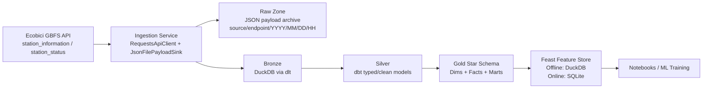

# CDMX Ecobici Data Platform

End-to-end modular data platform for **hourly/day-of-week demand and availability prediction** on Ecobici stations in CDMX.

## Architecture Overview

This repository follows a **Medallion architecture** and is designed to evolve from batch to micro-batch ingestion.



### Data Layers

- **Raw zone:** immutable payload files for lineage, replay, and backfills.
- **Bronze:** minimally transformed ingestion tables loaded by `dlt`.
- **Silver:** cleaned and typed station status snapshots.
- **Gold:** analytical star schema with facts/dimensions and training marts.
- **Feature Store:** Feast entities/views for model-ready retrieval.

## Why this design scales

- Reusable contracts (`ApiClient`, `PayloadSink`) allow onboarding new APIs with minimal changes.
- Partitioned raw payload storage enables deterministic reprocessing.
- Frequent scheduled runs can convert batch to micro-batch without redesigning the data model.
- dbt and Feast are decoupled from ingestion internals, accelerating ML iteration.

## Project structure

- `src/ecobici_platform/ingestion`: reusable ingestion module.
- `resources/raw_payloads`: partitioned API payload storage.
- `dbt/`: medallion SQL models and Gold star schema.
- `feast_repo/feature_repo`: Feast registry and feature views.
- `notebooks/`: feature-engineering exploration notebooks.
- `tests/`: baseline unit tests for ingestion/settings/sinks.

## Local setup and execution

### 1) Install required tools

- **Python 3.11** (required by project constraints):
  - https://www.python.org/downloads/release/python-3110/
- **Poetry** (dependency manager):
  - https://python-poetry.org/docs/#installation
- **Git**:
  - https://git-scm.com/downloads
- *(Optional)* **Docker Desktop** for containerized runs:
  - https://www.docker.com/products/docker-desktop/

### 2) Clone and install dependencies

```bash
git clone <your-repo-url>
cd cdmx-ecobici-data-platform
poetry install
```

### 3) Run batch ingestion (Raw + Bronze)

```bash
poetry run python -m ecobici_platform.ingestion.ecobici_batch
```

### 4) Run dbt transformations (Silver + Gold)

```bash
cd dbt
poetry run dbt run --profiles-dir .
cd ..
```

### 5) Apply Feast feature definitions

```bash
cd feast_repo/feature_repo
poetry run feast apply
cd ../..
```

### 6) Run quality checks and tests

```bash
poetry run ruff check src tests
poetry run black --check src tests
poetry run pytest -q
```

### 7) Optional: run with Docker

```bash
docker compose up --build
```

## Gold layer star schema

### Dimensions
- `dim_time`: calendar attributes for day-level analysis.
- `dim_hour`: hourly demand windows.

### Facts
- `fact_station_availability`: station snapshot grain at `(station_id, status_timestamp)`.
- `fact_station_hourly_target_proxy`: proxy targets from consecutive snapshots.

### Marts
- `mart_hourly_demand_proxy`: aggregate baseline demand behavior by hour/day-window.
- `mart_station_hourly_target_training`: training-ready station-hour target aggregates.

## Target definition selected (implemented now)

We use a **proxy target** from consecutive station snapshots:

- `demand_departures_proxy = max(prev_bikes_available - bikes_available, 0)`
- `supply_arrivals_proxy = max(prev_docks_available - docks_available, 0)`
- `net_demand_pressure_proxy = demand_departures_proxy - supply_arrivals_proxy`

See `docs/target_definition.md` for assumptions and migration to real trips.

## Next step to micro-batches

1. Trigger ingestion every 5-15 minutes via scheduler (Prefect/Airflow/Cron).
2. Add watermark state (last fetched timestamp) and idempotent merge strategy in bronze.
3. Convert silver/gold dbt models to incremental where appropriate.
4. Materialize Feast features on aligned windows.

## Dependency compatibility policy

To avoid resolver failures caused by transitive incompatibilities (especially around Feast/dlt stacks),
this project currently pins the runtime to **Python 3.11** (`>=3.11,<3.12`) and constrains
`tenacity` to `<9.0` and `pyarrow` to `<18.1` for `feast[duckdb]` (0.47.x) compatibility.

If you need Python 3.12+, validate a full dependency upgrade matrix in CI before widening constraints.
