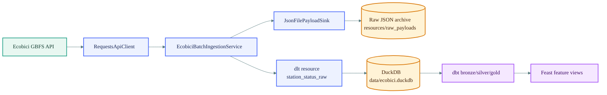
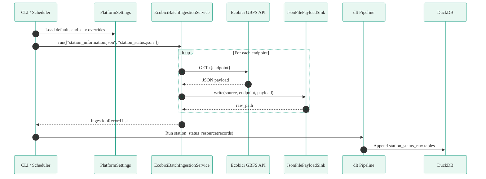
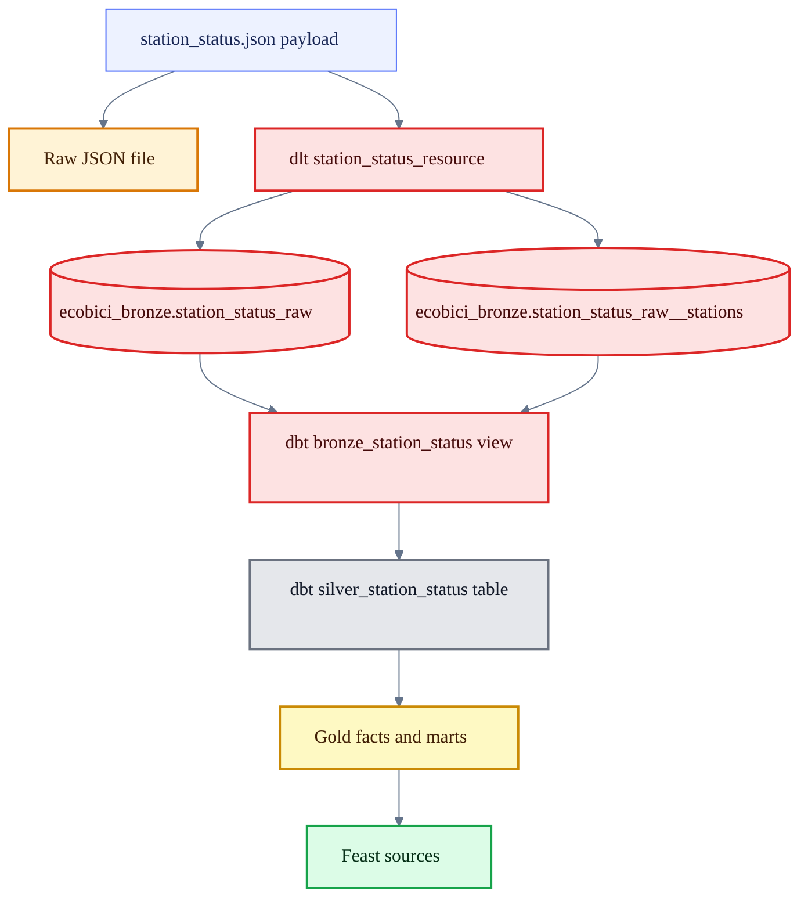

# Ecobici Platform Package

`ecobici_platform` is the Python package that extracts public Ecobici GBFS data,
archives the raw API responses, and loads the first bronze table into DuckDB.

This package is intentionally small: it is not a web server and it does not keep a
background process alive. It runs as a batch job, finishes, and can later be
scheduled by cron, Airflow, Prefect, Docker Compose, or another orchestrator.

## What This Package Does

The current ingestion job performs four main steps:

1. Read runtime settings from `.env` and defaults in `config/settings.py`.
2. Fetch GBFS JSON endpoints from the Ecobici API.
3. Save each full API response as immutable raw JSON under `resources/raw_payloads`.
4. Load `station_status.json` into DuckDB through a `dlt` resource named
   `station_status_raw`.

The broader repository then uses dbt and Feast downstream:

1. dbt reads the bronze `dlt` tables from DuckDB.
2. dbt creates cleaned silver models and feature-friendly gold models.
3. Feast defines station-level feature views on top of those analytics tables.

## Package Map

```text
src/ecobici_platform
├── __init__.py
├── config
│   └── settings.py              # Typed runtime settings from env/defaults
└── ingestion
    ├── ecobici_batch.py         # Batch entrypoint and ingestion orchestration
    ├── http_client.py           # Requests-based API client with retries
    ├── interfaces.py            # ApiClient and PayloadSink contracts
    └── sinks.py                 # JSON raw payload writer
```

## Architecture



## Runtime Flow



## Main Components

### `PlatformSettings`

Location: `config/settings.py`

`PlatformSettings` centralizes runtime configuration with Pydantic Settings. Values
come from environment variables, an optional `.env` file, or the defaults below.

| Setting | Default | Purpose |
| --- | --- | --- |
| `api_base_url` | `https://gbfs.mex.lyftbikes.com/gbfs/en` | Base URL for Ecobici GBFS feeds. |
| `api_timeout_seconds` | `30` | HTTP timeout used by the API client. |
| `raw_payload_root` | `resources/raw_payloads` | Root directory for archived raw JSON. |
| `dlt_dataset_name` | `ecobici_bronze` | DuckDB schema/dataset used by `dlt`. |
| `duckdb_path` | `data/ecobici.duckdb` | Local DuckDB file path. |

Example `.env`:

```dotenv
API_BASE_URL=https://gbfs.mex.lyftbikes.com/gbfs/en
API_TIMEOUT_SECONDS=30
RAW_PAYLOAD_ROOT=resources/raw_payloads
DLT_DATASET_NAME=ecobici_bronze
DUCKDB_PATH=data/ecobici.duckdb
```

### `ApiClient` and `RequestsApiClient`

Location: `ingestion/interfaces.py` and `ingestion/http_client.py`

`ApiClient` is a small interface with one responsibility: fetch a JSON payload for
an endpoint. `RequestsApiClient` implements it with `requests.get`, a configurable
timeout, and `tenacity` retry behavior:

- Up to 3 attempts.
- Exponential wait from 1 to 8 seconds.
- HTTP errors are raised with `response.raise_for_status()`.

This makes the ingestion service independent from the specific HTTP library. A
test, a future async client, or a different API source can replace the client as
long as it implements `fetch(endpoint)`.

### `PayloadSink` and `JsonFilePayloadSink`

Location: `ingestion/interfaces.py` and `ingestion/sinks.py`

`PayloadSink` defines where payloads are persisted. The current implementation
writes raw JSON files using this partitioned layout:

```text
resources/raw_payloads/
└── ecobici_gbfs/
    └── station_status/
        └── YYYY/
            └── MM/
                └── DD/
                    └── HH/
                        └── payload_YYYYMMDDTHHMMSSZ.json
```

This raw archive is useful because it preserves the original API response before
any transformation. If a downstream model changes, you can replay historical raw
payloads instead of calling the API again.

### `EcobiciBatchIngestionService`

Location: `ingestion/ecobici_batch.py`

This is the service layer. It coordinates extraction and raw persistence:

1. Create a `RequestsApiClient` from `settings.api_base_url`.
2. Create a `JsonFilePayloadSink` from `settings.raw_payload_root`.
3. For each configured endpoint:
   - Fetch the payload.
   - Write it to the raw archive.
   - Return an `IngestionRecord` with the endpoint, ingestion timestamp, raw path,
     and payload.

The service currently fetches:

- `station_information.json`
- `station_status.json`

Only `station_status.json` is loaded into DuckDB today. `station_information.json`
is archived in raw storage, but it does not yet have a `dlt` resource in this
package.

### `station_status_resource`

Location: `ingestion/ecobici_batch.py`

This `dlt` resource transforms the in-memory `IngestionRecord` objects into the
bronze load shape:

```python
{
    "endpoint": record.endpoint,
    "raw_path": record.raw_path,
    "last_updated": record.payload.get("last_updated"),
    "ttl": record.payload.get("ttl"),
    "stations": record.payload.get("data", {}).get("stations", []),
}
```

Because `stations` is a nested list, `dlt` normalizes it into parent/child DuckDB
tables. The dbt bronze model joins the parent table with the generated stations
child table.

## Data Flow and Storage



## How To Run Locally

Run commands from the repository root.

### 1. Install dependencies

```bash
poetry env use python3.11
poetry install
```

### 2. Run the ingestion batch

```bash
poetry run python -m ecobici_platform.ingestion.ecobici_batch
```

Equivalent Makefile command:

```bash
make ingest
```

Expected outputs:

- Raw JSON payloads under `resources/raw_payloads/...`.
- DuckDB database at `data/ecobici.duckdb`.
- `dlt` bronze tables in the `ecobici_bronze` dataset.

### 3. Run dbt transformations

```bash
cd dbt
poetry run dbt run --profiles-dir .
poetry run dbt test --profiles-dir .
cd ..
```

Equivalent Makefile command for the run step:

```bash
make dbt-run
```

### 4. Apply Feast feature definitions

```bash
cd feast_repo/feature_repo
poetry run feast apply
cd ../..
```

Equivalent Makefile command:

```bash
make feast-apply
```

## How To Run With Docker

Build and run the default ingestion command:

```bash
docker compose up --build
```

The Compose service mounts the repository into `/app`, so outputs written by the
container appear in your local working tree.

## How To Validate Changes

Run the test suite:

```bash
poetry run pytest -q
```

Run lint checks:

```bash
make lint
```

The focused ingestion tests cover:

- Default settings.
- Raw JSON sink partitioning.
- Batch service record creation.
- DuckDB parent directory creation.

## Extension Points

The package is designed for incremental growth:

| Need | Where to extend |
| --- | --- |
| Add another GBFS endpoint | Add the endpoint to `run_batch_pipeline()` and create a matching `dlt.resource` if it should enter DuckDB. |
| Swap HTTP behavior | Implement `ApiClient` and inject it into `EcobiciBatchIngestionService`. |
| Store raw payloads elsewhere | Implement `PayloadSink`, for example an S3/GCS/Azure Blob sink. |
| Move from batch to micro-batch | Schedule the same entrypoint more frequently, then add watermarking and idempotent bronze writes. |
| Add station metadata to bronze | Create a `station_information_resource` similar to `station_status_resource`. |

## Operational Notes

- The job appends to the `dlt` resource. Re-running ingestion can add another
  snapshot of the same API state if the source has not changed.
- The raw JSON archive is timestamped with the machine's current UTC time.
- `last_updated` comes from the API payload and represents the source feed's
  update time.
- `ensure_duckdb_parent_dir()` creates the DuckDB parent directory before the
  first local run.
- The package has no scheduler by itself. Scheduling is an external operational
  concern.

## Troubleshooting

### `ModuleNotFoundError: ecobici_platform`

Install the package through Poetry from the repository root:

```bash
poetry install
```

Then run Python commands with `poetry run`.

### The API call fails

Check network access and the configured base URL:

```bash
poetry run python -c "from ecobici_platform.config.settings import settings; print(settings.api_base_url)"
```

The client retries transient failures, but persistent HTTP errors will still stop
the batch.

### DuckDB file is missing

Run the ingestion command first. The file is created at `settings.duckdb_path`,
which defaults to:

```text
data/ecobici.duckdb
```

### dbt cannot find the expected bronze tables

Run ingestion before dbt:

```bash
poetry run python -m ecobici_platform.ingestion.ecobici_batch
cd dbt && poetry run dbt run --profiles-dir .
```

